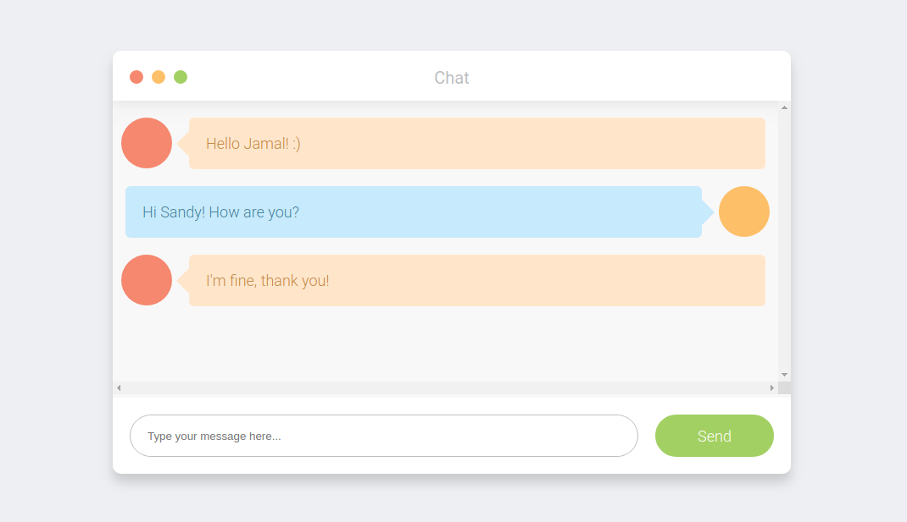

## SwooleWebChat

## Details

this is a simple web chat application using php and swoole for real time

This Chat app allows you to send messages Real Time

### Preview



## Requirements

- [PHP 7.0](http://php.net) or higher
- [Swoole](https://www.swoole.co.uk)

## Installing / Getting started

To install this project you must first install swoole

Install by binary releases

Linux users

> Swoole is available as a PECL compatible package

```bash
pecl install swoole
```

MacOS X (macOS) users

> It is highly recommended to install Swoole on Mac OS X or macOS systems via homebrew

```bash
brew install swoole
```

Enable swoole

After installing the swoole extension to the PHP extensions directory, you will need to edit php.ini and add an extension=swoole.so line before you can use the swoole extension.

```bash
php -i | grep php.ini                      # check the php.ini file location
sudo echo "extension=swoole.so" > php.ini  # add the extension=swoole.so to the end of php.ini
php -m | grep swoole                       # check if the swoole extension has been enabled
```

When you make sure everything is complete you can download the project.

```shell
git clone https://github.com/jamalhassouni/swoolewebchat.git
cd swoolewebchat
```

For local development you may run PHP's built-in web server:

1.  Start a websocket server

```bash
php swoolewebchat/server.php
```

2.  browse [http://localhost/swoolewebchat/](http://localhost/swoolewebchat/).

## Technology

- HTML
- CSS
- PHP
- Swoole
- WebSocket
